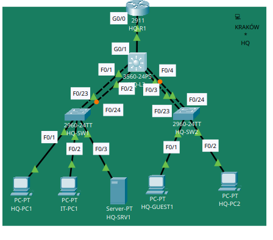
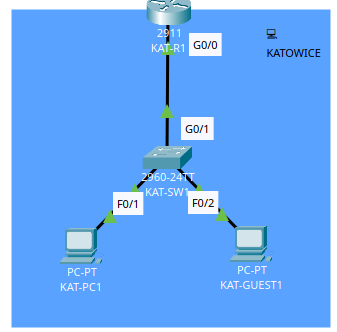
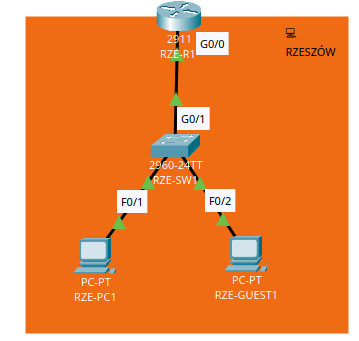

# HQ + Branches NOC Lab

Cisco Packet Tracer lab connecting a headquarters in Kraków with branches in Katowice and Rzeszów. Built around network configuration, verification, and incident troubleshooting.

**Status:** site layouts captured; HQ-L3 model and interface checks recorded. Full-network validation and configuration exports pending.

<table>
  <tr>
    <td width="40%"></td>
    <td width="30%"></td>
    <td width="30%"></td>
  </tr>
</table>

Separate Packet Tracer site views; open each image for detail. [Full target design](docs/NETWORK.md).

**Planned scope:** HQ collapsed core with SVI gateways, branch router-on-a-stick, VLANs, STP, LACP, OSPF, DHCP/DNS, NAT/PAT, SSH, and ACLs. Internet access is simulated inside the lab.

## Project files

- [Network design and build steps](docs/NETWORK.md)
- [Validation checklist and results](docs/VALIDATION.md)
- [Device configuration exports](configs/README.md)
- [Incident report template](incidents/TEMPLATE.md)

## Reproduce

Use **Cisco Packet Tracer 9.0.1** and follow the build steps. Save numbered milestones in `packet-tracer/checkpoints/`, export their device configurations, and record test evidence in `docs/evidence/`.
