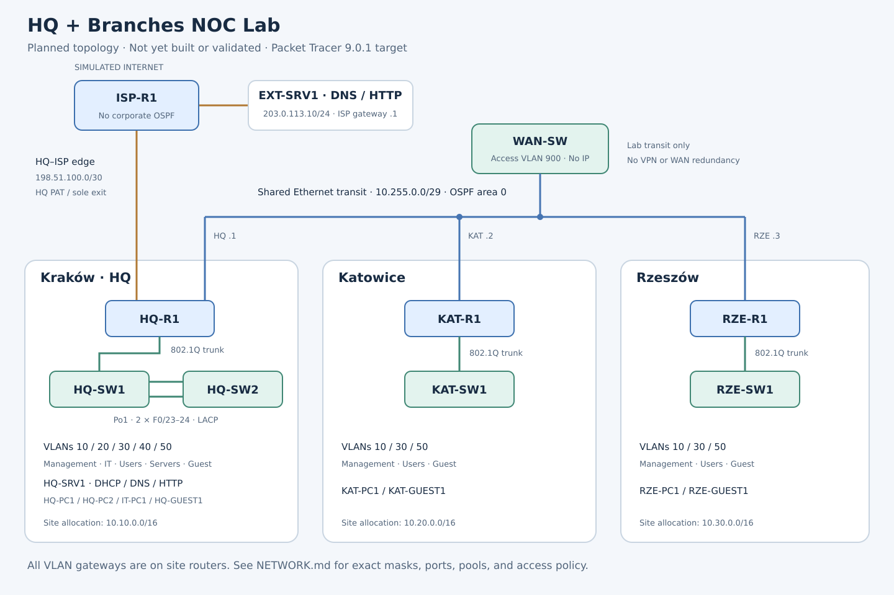

# HQ + Branches NOC Lab

A Cisco Packet Tracer lab for Junior NOC and Network Support roles: connect three offices, configure their services and access controls, then diagnose reproducible faults.

**Current state:** build plan and addressing prepared; topology construction is next. No `.pkt` checkpoint, device configuration export, or network validation result exists yet.

## Explore the project

| What you want to see | Where to look |
|---|---|
| Network design, addressing, and assembly steps | [Network build sheet](docs/NETWORK.md) |
| Expected behavior and recorded test results | [Validation](docs/VALIDATION.md) |
| Full configuration of each device | [Configuration exports](configs/README.md) — none yet |
| Fault investigation and recovery | [Incident format](incidents/TEMPLATE.md) — no completed incidents yet |

## Scope

The fictional company has about 72 staff across Kraków headquarters, Katowice, and Rzeszów. Representative endpoints keep the simulation readable while subnets allow room for growth.

The intended build covers VLANs, trunks, STP, EtherChannel, inter-VLAN routing, single-area OSPF, DHCP relay, DNS, NAT/PAT, SSH, and ACLs. These are planned capabilities until the linked tests contain evidence.

The Internet is simulated inside Packet Tracer. One router per site, one transit switch, and one Internet edge keep the lab manageable. The HQ EtherChannel will demonstrate member-link failure; the topology does not provide full device or WAN redundancy.

## Open and reproduce

Target simulator: **Cisco Packet Tracer 9.0.1**. Device models and commands must be checked in that installed version during the build.

1. Follow the [assembly steps](docs/NETWORK.md#first-packet-tracer-checkpoint).
2. Configure one working section at a time and run its [checks](docs/VALIDATION.md).
3. Save numbered files under `packet-tracer/checkpoints/` and export the corresponding full device configurations.

The final filename is reserved as `packet-tracer/HQ-Branches-NOC-Lab.pkt`; it will be created only after baseline validation. Fault copies and their reports will live together under `incidents/`, separate from the clean baseline.

## Working notes

[Current block and next action](.project/STATUS.md) · [Decisions](.project/DECISIONS.md) · [Change history](.project/CHANGELOG.md)

The `.project/` folder is hidden by default in many file managers because its name starts with a dot. Enable hidden-file display or open `.project/STATUS.md` directly from the project root. Relative links in this README require the complete project folder; a standalone copy of the README does not contain the linked documents. When publishing to GitHub, include those documents and images in the repository along with the README.

The linked working notes are part of the repository. Historical planning archives, local agent state, and machine-specific installation notes are kept locally and excluded from publication.

Project documentation, configuration comments, diagram labels, evidence captions, and incident reports use English. CV and LinkedIn material will describe only completed, verified lab work.

## Working with Codex

Read this README once, then start each session with the **Next action** in [STATUS](.project/STATUS.md). Read the matching section of [NETWORK](docs/NETWORK.md) and the relevant check in [VALIDATION](docs/VALIDATION.md). You do not need to reread the full plan or the archive before configuring a device.

You operate Packet Tracer: place devices, connect ports, enter configuration, run checks, and save the lab. Codex explains each configuration slice, reviews the supplied files and evidence, and maintains the documentation and working status. Report any model, port, or command difference so the build sheet can be corrected consistently.

| Review material | Save it under | What it allows Codex to check |
|---|---|---|
| Saved lab | `packet-tracer/checkpoints/HQ-Branches-NOC-Lab_vNN_description.pkt` | Exact milestone retained for reopening; its presence alone does not prove network behavior |
| Topology overview and readable port close-ups | `docs/evidence/v01_B1_topology.png`, with additional uniquely named images as needed | Visible device names, models, cabling, and labels |
| Full device configuration | `configs/<hostname>.cfg` | Addressing, VLANs, routing, ACL logic, and consistency between devices |
| Diagnostic command output and endpoint tests | `docs/evidence/vNN_<test-ID>_<device>_<check>.txt` or `.png` | Observed state and whether the specific expected behavior is supported by evidence |

Follow the [configuration export steps](configs/README.md#save-and-export-a-device). Keep all files for a review tied to the same saved checkpoint. Use a new evidence filename when recapturing a result so earlier observations remain available.

After saving, tell Codex the checkpoint path, which devices changed, where the evidence is, and what worked or failed. Files in this shared project can be read directly; they do not need to be attached again. Screenshots may also be attached in chat, but save useful evidence in the project for later review. Codex does not automatically watch your Packet Tracer session.

This session has no direct Packet Tracer desktop control. Configuration review and screenshot review are possible; runtime checks must be executed in Packet Tracer and supplied as evidence. A screenshot of green links or a plausible configuration is not a full validation pass.

**First handoff:** save and reopen v01, then provide a topology overview with names and readable port labels (or close-ups). Confirm that the file reopened successfully and report any device/port differences. Configuration exports are not required for this initial unconfigured topology.
