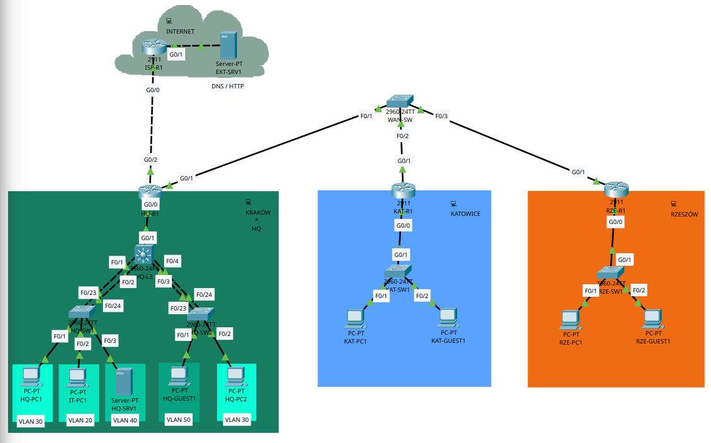

# HQ + Branches NOC Lab

Cisco Packet Tracer lab connecting a headquarters in Kraków with branches in Katowice and Rzeszów. Built around network configuration, verification, and incident troubleshooting.

**Status:** HQ VLAN assignments, both LACP trunks and VLAN 30 STP roles checked from CLI output. Routing tests and configuration exports pending.

Current layout, 2026-09-09. Open the image for detail; see the [network design](docs/NETWORK.md) for addressing and intended behavior.

**Planned scope:** HQ collapsed core with SVI gateways, branch router-on-a-stick, VLANs, STP, LACP, OSPF, DHCP/DNS, NAT/PAT, SSH, and ACLs. Internet access is simulated inside the lab.

## Project files

- [Network design and build steps](docs/NETWORK.md)
- [Validation checklist and results](docs/VALIDATION.md)
- [Device configuration exports](configs/README.md)
- [Incident report template](incidents/TEMPLATE.md)

## Reproduce

Use **Cisco Packet Tracer 9.0.1** and follow the build steps. Save numbered milestones in `packet-tracer/checkpoints/`, export their device configurations, and record test evidence in `docs/evidence/`.
