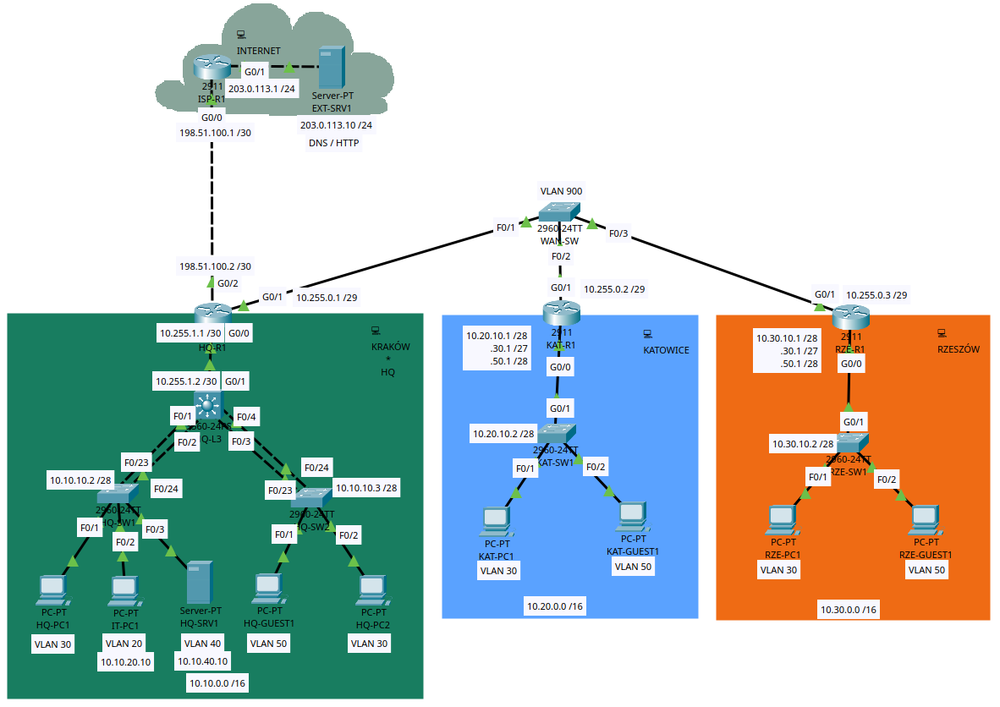

# HQ + Branches NOC Lab

A Cisco Packet Tracer network connecting a headquarters in **Kraków** with branches in **Katowice** and **Rzeszów**. The lab follows the work of a network support engineer: configure the network, verify traffic, diagnose faults and document recovery.

*Logical architecture. Implementation progress and tested behavior are documented in [Validation](docs/VALIDATION.md).*

## The network

- **Headquarters:** a Layer 3 switch provides VLAN gateways; two access switches connect through separate LACP bundles.
- **Branches:** each site uses a router and access switch with router-on-a-stick VLAN routing.
- **Site connectivity:** shared Ethernet WAN transport, OSPF and a central Internet edge at HQ.
- **Services and access:** DHCP relay, DNS/HTTP, NAT/PAT, SSH management and VLAN-based traffic controls.

The design uses **20 devices and 21 physical links**. Internet services are simulated entirely inside Packet Tracer. HQ has one core switch and one Internet exit; redundancy exercises cover individual EtherChannel members.

## Explore the project

| Start here | What you will find |
|---|---|
| [Network design](docs/NETWORK.md) | Devices, cabling, VLANs, addressing and traffic policy |
| [Validation](docs/VALIDATION.md) | Verified results, supporting evidence and remaining checks |
| [Device configurations](configs/README.md) | Current configuration captures and restore notes |
| [Checkpoint status](docs/VALIDATION.md#checkpoints) | Saved-state verification and download availability |
| Incident reports | [Wrong VLAN](incidents/IR-001/README.md), [OSPF adjacency](incidents/IR-002/README.md), [DHCP relay](incidents/IR-003/README.md), [HTTP ACL](incidents/IR-004/README.md) |
| [Incident template](incidents/TEMPLATE.md) | Structure for fault reproduction, diagnosis and recovery |

## Run the lab

1. Use **Cisco Packet Tracer 9.0.1** and follow the [build order](docs/NETWORK.md#build-order).
2. Check [checkpoint availability and tested scope](docs/VALIDATION.md#checkpoints) before using a saved state. Keep a separate working copy for changes.
3. Repeat the relevant [checks](docs/VALIDATION.md#test-checklist) and compare results with the configuration captures.
